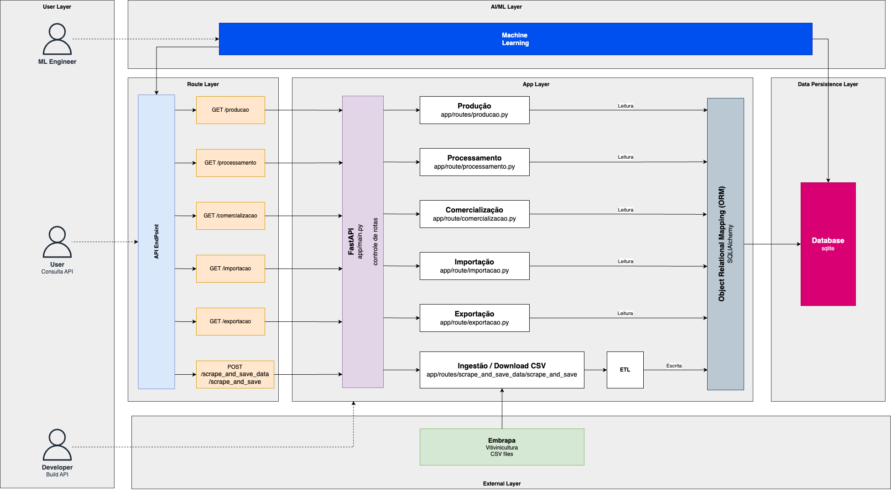

# TechChallenge 1 - Turma 2MLET

## Problema

Você foi contratado(a) para um consultoria e seu trabalho envolve analisar os dados de vitivinicultura da [Embraba](http://vitibrasil.cnpuv.embrapa.br/index.php?opcao=opt_01).
A idéia do projeto é a criação de uma API pública de consulta nos dados do site nas respectivas abas:

/ Produção

/ Processamento

/ Comercialização

/ Importação

/ Exportação

A API vai servir para alimentar uma base de dados que futuramente será usada para um modelo de Machine Learning.

## Objetivos

1. Criar um REST API em Python que faça a consulta no site da Embrapa.
2. Sua API deve estar documentada.
3. É recomendável (não obrigatório) a escolha de um método de autenticação (JWT, por exemplo).
4. Criar um plano para fazer o deploy da API, desenhando a arquitetura do projeto desde a ingestão até a 
alimentação do modelo (aqui não é necessário elaborar um modelo de ML, mas é preciso que vocês escolham um cenário interessante em que a API possa ser utilizada.)
5. Fazer um MVP realizando o deploy com um link compartilhável e um repositório no github.


## Iniciar o App
```bash
#1.Clonar este repositório
git clone https://github.com/HugoVasc/vitivinicultura-embrapa-api

#2.Criar o virtual env
cd vitivinicultura-embrapa-api/
python3 -m venv venv
source venv/bin/activate

#3.Instalar os pré-requisitos
pip3 install -r requirements.txt

#4.Inicializar o fastapi
uvicorn app.main:app --reload --host 0.0.0.0
```

## Documentação da API

**SCRAP** dos dados da Embrapa, ETL e gravação no Banco de Dados (SQLite)

```http
  POST /scrape_and_save_data/scrape_and_save
```

Consulta dos dados de **PRODUCAO**

```http
  GET /producao
  GET /producao/categoria
  GET /producao/categoria/lista
  GET /producao/subcategoria
  GET /producao/subcategoria/lista
  GET /producao/subcategoria/tipo
```

Consulta dos dados de **PROCESSAMENTO**

```http
  GET /processamento
  GET /processamento/id_categoria/{category_id}
  GET /processamento/ano/{year}
  GET /processamento/id_categoria/{category_id}/ano/{year}
```

Consulta dos dados de **COMERCIALIZACAO**

```http
  GET /comercializacao
  GET /comercializacao/categoria
  GET /comercializacao/categoria/lista
  GET /comercializacao/subcategoria
  GET /comercializacao/subcategoria/lista
  GET /comercializacao/subcategoria/tipo
```

Consulta dos dados de **IMPORTACAO**

```http
  GET /importacao
```

Consulta dos dados de **EXPORTACAO**

```http
  GET /exportacao
```

## Plano / Desenho



## Colaboradores:

- Euclides Freire - RM357398
- Hugo Vasconcelos - RM358003
- Gerson Itiro - RM357371
- João Dias - RM357713
